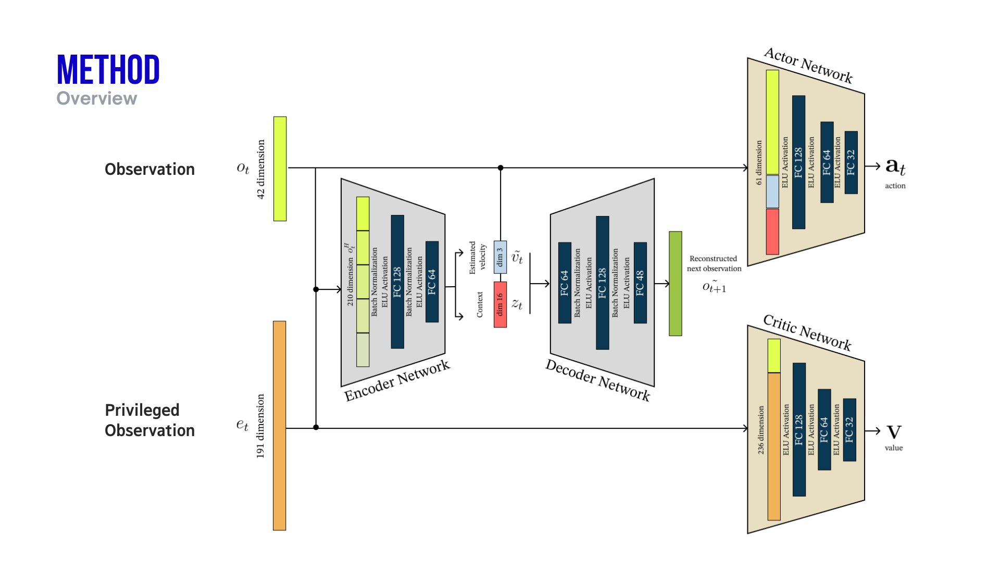

# go2_walk

<p align="center">
  
</p>

<p align="center">
  <strong>Demonstration Code for <a href="https://www.unitree.com/go2/">Unitree Go2</a> Quadruped Robot Walking</strong>
</p>

<p align="center">
  <a href="#-dreamwaq-main">dreamwaq (Main)</a> •
  <a href="#-gym_basic">gym_basic</a> •
  <a href="#-unitree_rl_gym">unitree_rl_gym</a> •
  <a href="#-wtw">wtw</a>
</p>

---

## Project Structure

```
go2_walk/
├── dreamwaq/           # [Main] Rough terrain with state estimation
│   ├── legged_gym/
│   └── rsl_rl/
├── gym_basic/          # [Sub] Basic IsaacGym examples
├── unitree_rl_gym/     # [Ref] Flat terrain locomotion
└── wtw/                # [Ref] Sim-to-Real deployment
    ├── go2_gym/
    ├── go2_gym_learn/
    └── go2_gym_deploy/
```

---

## ⭐ `dreamwaq` (Main)

> **Rough Terrain Locomotion with State Estimation**

[](https://opensource.org/licenses/MIT)

| | |
|---|---|
| Author | [Jungyeon Lee (curieuxjy)](https://github.com/curieuxjy) |
| Paper | [DreamWaQ: Learning Robust Quadrupedal Locomotion](https://arxiv.org/abs/2301.10602) |
| Achievement | **1st Place** at [ICRA 2023 Autonomous Quadruped Robot Challenge (QRC) Final](https://github.com/curieuxjy/Awesome_Quadrupedal_Robots/discussions/5) |
| Related | [Fall Recovery Task](https://arxiv.org/abs/2306.12712) |

I independently implemented the DreamWaQ algorithm based on the paper. The core component, [**Context-aided Estimator Network (CENet)**](./dreamwaq/rsl_rl/rsl_rl/vae/cenet.py), has been carefully implemented and verified to work as described. Feel free to explore the code and experiment with it!



> 📖 For detailed setup instructions including Docker configuration and training commands, please refer to the [dreamwaq/README.md](./dreamwaq/README.md).

---

## 📦 `gym_basic`

> **Go2 in IsaacGym**

- IsaacGym ver.4 basic examples
- Camera and joint inspection demos

---

## 📚 `unitree_rl_gym`

> **Flat Terrain Locomotion** *(Reference)*

| | |
|---|---|
| Original | [unitreerobotics/unitree_rl_gym](https://github.com/unitreerobotics/unitree_rl_gym) |
| Based on | [leggedrobotics/legged_gym](https://github.com/leggedrobotics/legged_gym) |

---

## 📚 `wtw`

> **Sim-to-Real Deployment** *(Reference)*

| | |
|---|---|
| Paper | [Walk These Ways](https://arxiv.org/abs/2212.03238) |
| Original | [Teddy-Liao/walk-these-ways-go2](https://github.com/Teddy-Liao/walk-these-ways-go2) |
| Based on | [Improbable-AI/walk-these-ways](https://github.com/Improbable-AI/walk-these-ways) |

---

## References

- [go2_omniverse](https://github.com/abizovnuralem/go2_omniverse)
